<div align="center">

```
   █████╗ ██╗  ████████╗███████╗██████╗
  ██╔══██╗██║  ╚══██╔══╝██╔════╝██╔══██╗
  ███████║██║     ██║   █████╗  ██████╔╝
  ██╔══██║██║     ██║   ██╔══╝  ██╔══██╗
  ██║  ██║███████╗██║   ███████╗██║  ██║
```

**No server. No trace. Just you and who you trust.**

[](https://github.com/0xAre/alter/releases)
[](https://www.rust-lang.org)
[](LICENSE)
[](https://github.com/0xAre/alter/actions)

</div>

---

<div align="center">
  
</div>

---

## Instalasi

**Windows** — satu baris, selesai:
```powershell
irm https://raw.githubusercontent.com/0xAre/alter/main/install.ps1 | iex
```

**Linux / macOS:**
```bash
curl -sSfL https://raw.githubusercontent.com/0xAre/alter/main/install.sh | sh
```

**Cargo (jika Rust sudah ada):**
```bash
cargo install --git https://github.com/0xAre/alter
```

> Tidak butuh OpenSSL. Tidak butuh daemon Tor terpisah. Satu binary, langsung jalan.

---

## Apa itu ALTER?

Terminal chat yang bekerja tanpa server.

Dua orang terhubung langsung — via LAN di satu jaringan, atau via **Tor** di mana saja di dunia. Setiap sesi dienkripsi end-to-end menggunakan **Noise Protocol (IK pattern)**. Saat salah satu keluar dari room, kunci sesi dibuang — tidak ada yang bisa membaca percakapan itu lagi, bahkan pengirimnya sendiri.

<table>
<tr>
<td width="33%" valign="top">
<b>Tanpa server</b><br><br>
Tidak ada backend yang bisa diretas, disita, atau tumbang. Koneksi langsung peer-to-peer, selalu.
</td>
<td width="33%" valign="top">
<b>Ephemeral</b><br><br>
Pesan hanya ada di RAM. Kunci sesi dibuang saat room ditutup — riwayat tidak bisa dibaca ulang.
</td>
<td width="33%" valign="top">
<b>Deniable</b><br><br>
Passphrase berbeda membuka Password Manager biasa. Tidak ada cara membuktikan ALTER ada di vault yang sama.
</td>
</tr>
</table>

---

## Fitur

**Noise_IK End-to-End** — mutual authentication + forward secrecy dalam satu handshake. Tidak bisa di-MITM tanpa private key peer.

**Tor built-in** — ALTER menjalankan onion service sendiri. Tidak perlu install atau konfigurasi Tor terpisah.

**LAN-first, Tor fallback** — di satu jaringan: koneksi langsung TCP. Lintas internet: lewat Tor otomatis.

**Transfer file terenkripsi** — kirim file hingga 4 GB langsung lewat sesi. SHA-256 end-to-end. Gambar bisa dilihat inline. Tidak ada relay, tidak ada upload ke cloud.

**Password Manager decoy** — satu vault, dua passphrase. Passphrase decoy membuka PM biasa. Plausible deniability bawaan.

**Reply & scroll history** — balas pesan spesifik dengan kutipan. Scroll riwayat chat dengan PageUp/PageDown.

**Panic wipe** — `Ctrl+Shift+X` dua kali dalam 3 detik: zeroize semua secret di RAM, exit seketika.

<details>
<summary>Selengkapnya: arsitektur kriptografi</summary>

<br>

```
NOISE TRANSPORT
  Noise_IK_25519_ChaChaPoly_BLAKE2s
  ├─ Mutual authentication — kedua static key diverifikasi
  ├─ Forward secrecy — ephemeral X25519 DH per sesi, dibuang setelah handshake
  └─ Identity hiding — static key initiator dienkripsi dalam message pertama

TRANSPORT
  ├─ LAN : TCP direct via mDNS discovery
  └─ Tor : onion service via arti-client (embedded, tanpa daemon)

VAULT v2 (4096 B)
  Argon2id KDF + ChaCha20-Poly1305
  Dual-slot independen: Slot A (PM decoy) · Slot B (ALTER keys)
  Tanpa header / magic bytes — indistinguishable from random data
```

**Properti keamanan:**

| Property | Status |
|---|---|
| Mutual authentication | ✓ Noise_IK — kedua pihak memverifikasi static key lawan |
| Forward secrecy | ✓ Ephemeral X25519 DH per sesi |
| Identity hiding | ✓ Static key initiator dienkripsi di message pertama |
| Zero memory leak | ✓ `ZeroizeOnDrop` semua struct yang menyimpan secret |
| Plausible deniability | ✓ Vault tanpa magic bytes, passphrase decoy membuka PM |
| Encrypted contact list | ✓ Social graph dienkripsi di disk |

> v0.5.1 — belum diaudit pihak ketiga. Gunakan dengan pertimbangan risiko yang sesuai.

</details>

---

## Mulai Pakai

```
1.  alter                       # jalankan — LAN aktif seketika, Tor di background
2.  Tekan [i]                   # tampilkan invite code kamu
3.  Bagikan ke peer             # via Signal, kertas, atau channel aman lainnya
4.  Tekan [a] → paste invite    # tambah kontak peer (+ spasi + nickname opsional)
5.  Pilih kontak → [Enter]      # buka room terenkripsi
```

> Kedua pihak perlu menekan `Enter` ke kontak yang sama. Role (Initiator/Responder) ditentukan otomatis dari fingerprint — tidak perlu koordinasi manual.

### Keybinding

| Tombol | Konteks | Aksi |
|--------|---------|------|
| `↑` / `↓` | Main | Pilih kontak |
| `Enter` | Main | Buka sesi ke kontak terpilih |
| `a` | Main | Tambah kontak baru (paste invite code) |
| `r` | Main | Ganti nama kontak |
| `d` | Main | Hapus kontak (minta konfirmasi) |
| `i` | Mana saja | Tampil / tutup invite code |
| `c` | Mana saja | Salin invite code ke clipboard |
| `PageUp` / `PageDown` | Room | Scroll riwayat chat |
| `r` | Room | Reply pesan (kutipan inline) |
| `Ctrl+F` | Room | Kirim file |
| `[S]` / `[L]` / `[T]` | File diterima | Simpan / Lihat inline / Tolak |
| `Esc` | Room | Keluar room (riwayat dibuang) |
| `Ctrl+Shift+X` × 2 | Mana saja | Panic wipe — zeroize semua secret, exit |

<details>
<summary>Opsi CLI lengkap</summary>

<br>

```
alter                 Jalankan TUI (mode default: online)
alter id              Cetak invite code lalu keluar

  --vault <path>      Lokasi vault (default: ~/.alter/id.key)
  --offline           LAN saja — matikan Tor
  --add <invite>      Pra-muat kontak saat startup
  --name <nickname>   Nickname untuk --add
  --listen <port>     Force responder di port ini (untuk testing)
  --dial <ip:port>    Force dial langsung (untuk testing)
  -h, --help          Tampilkan bantuan
```

Passphrase via environment (untuk skrip/automasi):
```bash
ALTER_PASSPHRASE="passphraseku" alter id
```

</details>

---

## Status — v0.5.1

```
M0  Fondasi: identity, vault, Noise_IK handshake           ✓
M1  LAN MVP: mDNS, TCP, TUI, chat 1-on-1                   ✓
M2  Internet: Tor onion service + LAN fallback              ✓
M3  Hardening: padding, panic-wipe, mlock                   ✓
M4  Polish & audit                                          ✓
M5  Presence privacy: Restricted Discovery (SEC-13)         ✓
M6  Password Manager decoy front (vault v2 dual-slot)       ✓
FT  File transfer terenkripsi — hingga 4 GB (v0.5.1)        ✓
```

<details>
<summary>Changelog lengkap</summary>

<br>

**v0.5.1** — File Transfer + UX
- Transfer file terenkripsi (FT-01): SHA-256 end-to-end, chunked streaming, hingga 4 GB
- Image preview inline via viuer (setelah terima file gambar, pilih [L])
- Reply dengan kutipan: `r` di room untuk balas pesan spesifik
- Scroll riwayat chat: PageUp/PageDown dengan 5-pesan per langkah
- Warning auto-dismiss (8 detik), input length limit per konteks

**v0.5.0** — Password Manager Decoy Front
- Vault v2 (4096 B): dual-slot independen — slot A (PM decoy) + slot B (ALTER keys)
- Password Manager TUI: tambah / lihat / hapus / cari entries
- Backup codes per entry (maks 10, mark-as-used)
- Async unlock dengan spinner (Argon2id ~500ms di background thread)

**v0.4.0** — Presence Privacy
- Restricted Discovery (SEC-13): onion service hanya accessible ke kontak dengan client auth
- Tor client auth x25519 terintegrasi ke invite code v2

</details>

---

## Kontribusi

1. Fork → buat branch dari `main`
2. Buat perubahan, pastikan `cargo test` hijau dan `cargo clippy` bersih
3. Commit dengan format [Conventional Commits](https://www.conventionalcommits.org/)
4. Buka Pull Request

---

<div align="center">

*"Privacy is not about having something to hide — it's about having something to protect."*

[Releases](https://github.com/0xAre/alter/releases) · [Issues](https://github.com/0xAre/alter/issues) · [GPL-3.0](LICENSE)

</div>
